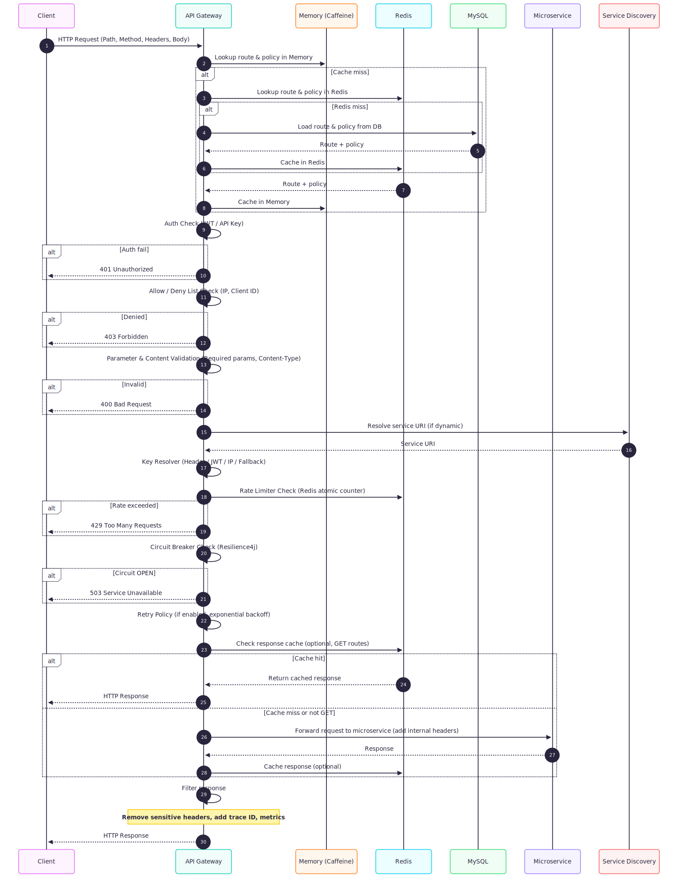

# API Gateway 

## Overview

This project is a **dynamic API Gateway** built with **Spring Cloud Gateway** and **Reactive Spring WebFlux**.

It supports:

- Dynamic route registration
- Rate limiting with Redis + custom Key Resolvers
- Circuit breaker policies with Resilience4J
- Runtime JSON configuration caching for high-performance routing
- Optional caching via Redis, Caffeine, or Hazelcast

The gateway allows **dynamic configuration** of routes and policies without restarting the server.

---

## Dependencies

- **Spring Boot 3.4.4** – core framework
- **Spring Cloud Gateway** – reactive gateway
- **Resilience4J** – circuit breaker
- **Redis (reactive)** – caching & rate limiting
- **Micrometer + Prometheus** – metrics monitoring
- **Spring Data JPA + MySQL** – configuration storage
- **Optional Caching**: Caffeine or Hazelcast
- **Seyha Logger** – custom logging library

---

## Project Structure

```
com.example.apigateway
├── config        # Gateway, Redis, Circuit Breaker, Key Resolver
├── controller    # REST APIs to register routes & policies
├── dto           # Data Transfer Objects for API requests/responses
├── entity        # JPA Entities mapping to database tables
├── repository    # Spring Data JPA Repositories
├── service       # Business logic for routes, policies, caching
```

---

## Database Design

**Database:** `API_GATEWAY`

### 1️⃣ Gateway Route Table

```sql
CREATE TABLE gateway_route (
    id BIGINT AUTO_INCREMENT PRIMARY KEY,
    service_name VARCHAR(100) NOT NULL,
    route_code VARCHAR(100) NOT NULL UNIQUE,
    path VARCHAR(255) NOT NULL,
    target_uri VARCHAR(255) NOT NULL,
    http_method VARCHAR(20) NOT NULL,
    timeout_ms INT NOT NULL DEFAULT 30000,
    auth_required BOOLEAN NOT NULL,
    status ENUM('ACTIVE','INACTIVE','DEPRECATED') DEFAULT 'ACTIVE',
    created_at TIMESTAMP DEFAULT CURRENT_TIMESTAMP,
    updated_at TIMESTAMP DEFAULT CURRENT_TIMESTAMP ON UPDATE CURRENT_TIMESTAMP
);
```

- Stores **basic route information**
- `route_code` is used in **API responses** and logs

### 2️⃣ Key Resolver Policy Table

```sql
CREATE TABLE gateway_key_resolver_policy (
    id BIGINT AUTO_INCREMENT PRIMARY KEY,
    policy_code VARCHAR(50) NOT NULL UNIQUE,
    strategy VARCHAR(30) NOT NULL COMMENT 'HEADER, IP, etc',
    header_name VARCHAR(100) DEFAULT NULL,
    fallback_strategy VARCHAR(30) DEFAULT NULL,
    status ENUM('ACTIVE','INACTIVE','DEPRECATED') DEFAULT 'ACTIVE',
    created_at TIMESTAMP DEFAULT CURRENT_TIMESTAMP,
    updated_at TIMESTAMP DEFAULT CURRENT_TIMESTAMP ON UPDATE CURRENT_TIMESTAMP
);
```

- Identifies which **key to use** for rate limiting
- Can be reused across multiple rate limit policies

### 3️⃣ Rate Limit Policy Table

```sql
CREATE TABLE gateway_rate_limit_policy (
    id BIGINT AUTO_INCREMENT PRIMARY KEY,
    name VARCHAR(50) NOT NULL UNIQUE,
    replenish_rate INT NOT NULL,
    burst_capacity INT NOT NULL,
    window_seconds INT DEFAULT 1,
    key_resolver_policy_id BIGINT NOT NULL,
    status ENUM('ACTIVE','INACTIVE','DEPRECATED') DEFAULT 'ACTIVE',
    created_at TIMESTAMP DEFAULT CURRENT_TIMESTAMP,
    updated_at TIMESTAMP DEFAULT CURRENT_TIMESTAMP ON UPDATE CURRENT_TIMESTAMP,
    CONSTRAINT fk_rate_key_policy
        FOREIGN KEY (key_resolver_policy_id) REFERENCES gateway_key_resolver_policy(id)
        ON DELETE RESTRICT
        ON UPDATE CASCADE
);
```

- Links **rate limit policies** to **key resolvers**
- Can be shared among multiple routes

### 4️⃣ Circuit Breaker Policy Table

```sql
CREATE TABLE gateway_circuit_breaker_policy (
    id BIGINT AUTO_INCREMENT PRIMARY KEY,
    cb_name VARCHAR(50) NOT NULL UNIQUE,
    sliding_window_type ENUM('COUNT','TIME') DEFAULT 'COUNT',
    sliding_window_size INT DEFAULT 20,
    failure_rate_threshold INT DEFAULT 50,
    slow_call_rate_threshold INT DEFAULT 50,
    slow_call_duration_ms INT DEFAULT 2000,
    open_state_wait_ms INT DEFAULT 30000,
    half_open_calls INT DEFAULT 5,
    timeout_ms INT DEFAULT 2000,
    status ENUM('ACTIVE','INACTIVE','DEPRECATED') DEFAULT 'ACTIVE',
    created_at TIMESTAMP DEFAULT CURRENT_TIMESTAMP,
    updated_at TIMESTAMP DEFAULT CURRENT_TIMESTAMP ON UPDATE CURRENT_TIMESTAMP
);
```

- Can be reused among multiple routes
- Fully supports **Resilience4J configuration**

### 5️⃣ Route → Policies Map Table

```sql
CREATE TABLE gateway_route_policy_map (
    id CHAR(36) NOT NULL PRIMARY KEY,
    route_id BIGINT NOT NULL,
    rate_limit_policy_id BIGINT DEFAULT NULL,
    circuit_breaker_policy_id BIGINT DEFAULT NULL,
    status ENUM('ACTIVE','INACTIVE') DEFAULT 'ACTIVE',
    created_at TIMESTAMP DEFAULT CURRENT_TIMESTAMP,
    updated_at TIMESTAMP DEFAULT CURRENT_TIMESTAMP ON UPDATE CURRENT_TIMESTAMP,
    CONSTRAINT fk_route_map_route
        FOREIGN KEY (route_id) REFERENCES gateway_route(id)
        ON DELETE CASCADE
        ON UPDATE CASCADE,
    CONSTRAINT fk_route_map_rate
        FOREIGN KEY (rate_limit_policy_id) REFERENCES gateway_rate_limit_policy(id)
        ON DELETE SET NULL
        ON UPDATE CASCADE,
    CONSTRAINT fk_route_map_cb
        FOREIGN KEY (circuit_breaker_policy_id) REFERENCES gateway_circuit_breaker_policy(id)
        ON DELETE SET NULL
        ON UPDATE CASCADE
);
```

- **Links routes to policies dynamically**
- Gateway queries this to construct **runtime objects**

---

## Runtime JSON Example

```json
{
  "AUTH-SERVICE-ea63159f": {
    "serviceName": "auth-service",
    "path": "/api/oauth2/authorize",
    "targetUri": "http://localhost:8000",
    "method": "POST",
    "timeoutMs": 30000,
    "authRequired": false,
    "rateLimit": {
      "replenishRate": 5,
      "burstCapacity": 10,
      "windowSeconds": 1,
      "keyResolver": "X-User-Id"
    },
    "circuitBreaker": {
      "slidingWindowType": "COUNT",
      "windowSize": 20,
      "failureRateThreshold": 50,
      "slowCallRateThreshold": 50,
      "slowCallDurationMs": 2000,
      "openStateWaitMs": 30000,
      "halfOpenCalls": 5,
      "timeoutMs": 2000
    }
  }
}
```

- Keyed by `route_code` → easy lookup in runtime
- Built from **map table + related policies**
- Can be **cached in Redis** with TTL for performance

---

## API Endpoints

| Endpoint | Method | Description |
|----------|--------|-------------|
| `/api/v1/gateway/route/register` | POST | Register a new route |
| `/api/v1/gateway/route` | GET | List all registered routes |
| `/api/v1/gateway/rate-limit` | POST | Create rate limit policy |
| `/api/v1/gateway/circuit-breaker` | POST | Create circuit breaker policy |
| `/api/v1/gateway/route/map` | POST | Link route → policies |
| `/api/v1/gateway/routes` | GET | Return runtime object (full JSON) |

---

## Features

1. **Dynamic Routes** – add/remove routes without restarting gateway
2. **Dynamic Policies** – attach/detach rate limit & circuit breaker
3. **Caching** – Redis/Caffeine/Hazelcast for performance
4. **Metrics** – Prometheus monitoring via Micrometer
5. **Logging** – Centralized using Seyha Logger

---

## Configuration (application.yml)

```yaml
spring:
  application:
    name: api-gateway
  datasource:
    url: jdbc:mysql://localhost:3306/api_gateway
    username: root
    password:
    driver-class-name: com.mysql.cj.jdbc.Driver
  redi
```

## Sequence diagram flow


## Flow chart

